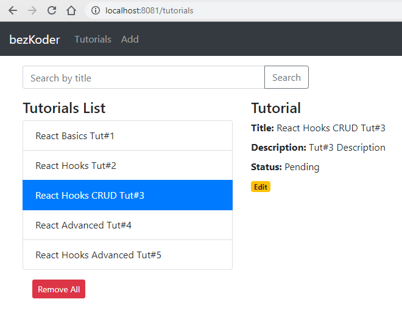

# React.js Hooks CRUD App with Axios & Web API example
Build a React Hooks CRUD Application to consume Web API with Axios, display and modify data with Router & Bootstrap.
- Each Tutorial has id, title, description, published status.
- We can create, retrieve, update, delete Tutorials.
- There is a Search bar for finding Tutorials by title.

# Certification SSL

Config nécessaire:

Dans la seconde partie du fichier Dockerfile, l'image nginx qui est utilisée pour hoster l'application buildé dans l'image node:17.0 contient une config de base pour l'application afin qu'elle puisse utiliser certboot et letsencrypt. 

 L'important c'est que les deux domaines y soient, dans mon cas, duacheteur.com et www.duacheteur.com

Commandes à lancer: 

a) On doit puller l'image

- docker pull patrickoceandigital/cert-frontend:latest

b) on doit créer le network (certnet est un nom que j'ai choisi, ça aurait pu être n'importe quoi)

- docker network create certnet

c) On doit runner le container: 
- -v sert a créé un mapping physique entre l'image et la machine qui host l'image afin de ne jamais perdre les infos de certboot
- -p 443:443 est le port pour la connexion ssl
- --net crée un network afin de faire communiquer le frontend et le backend
- --name donne un nom significatif au container au lieu des nom random créé par docker

docker run -v /etc/letsencrypt:/etc/letsencrypt -p 80:80 -p 443:443 --net certnet --name frontend patrickoceandigital/cert-frontend:latest

d) On doit se connecter sur le container
- docker exec -it frontend /bin/sh

e) On lance certboot
- certbot --nginx -d duacheteur.com -d www.duacheteur.com

- Note: trois questions sont à répondre:
    - 1. votre email
    - 2. Y (j'accepte les conditions)
    - 3. N (je veux pas envoyer d'info)

Suite à cette dernière commande, vous devriez voir un message de success de certboot

Le fichier default.conf devrait avoir été modifié par certboot.
